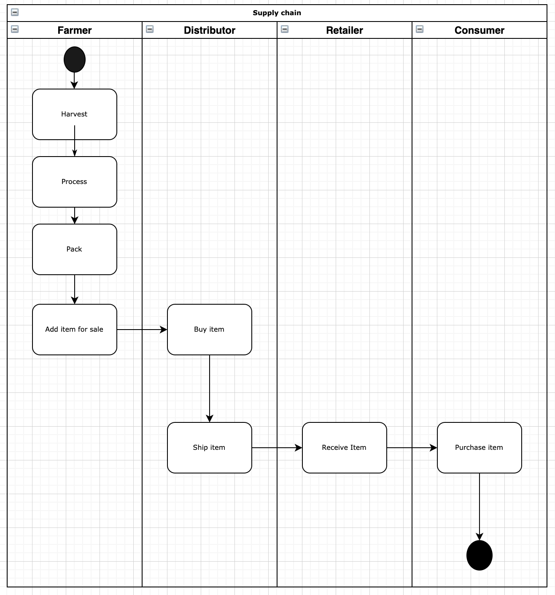
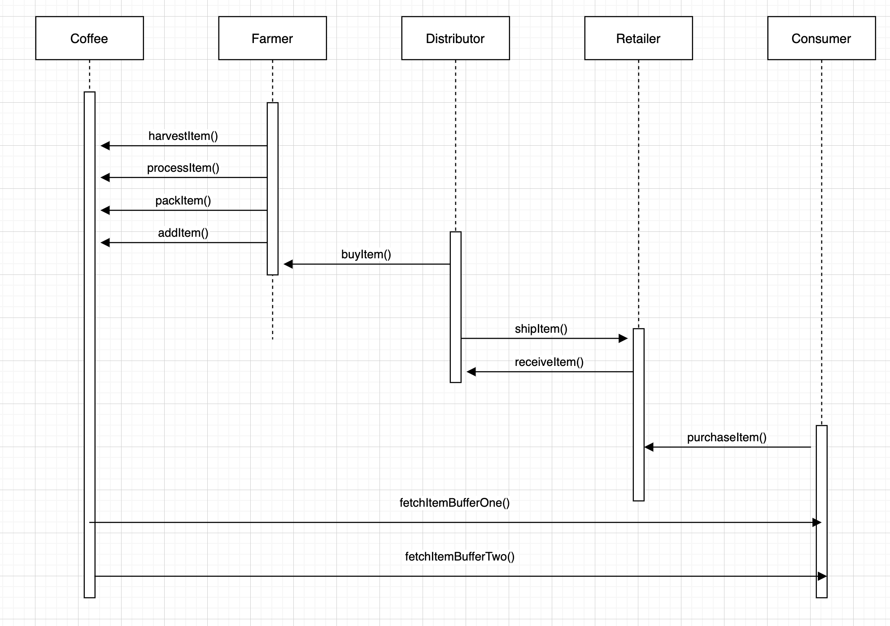
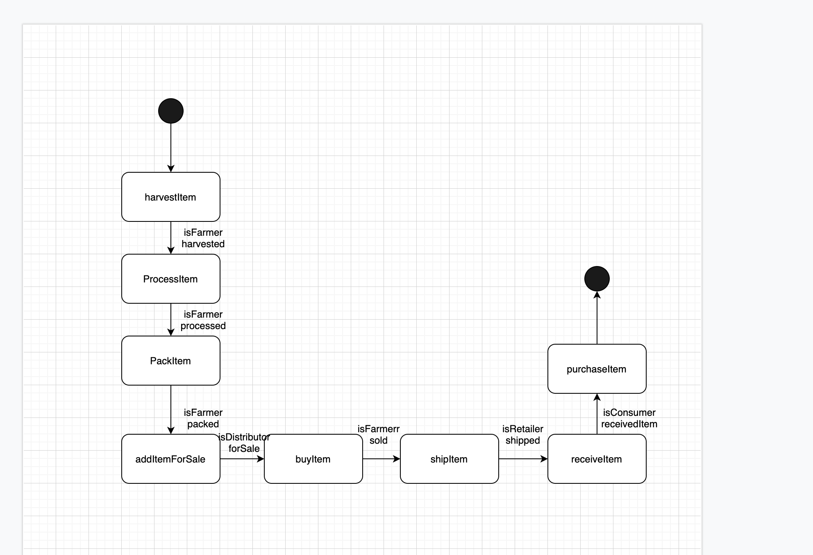
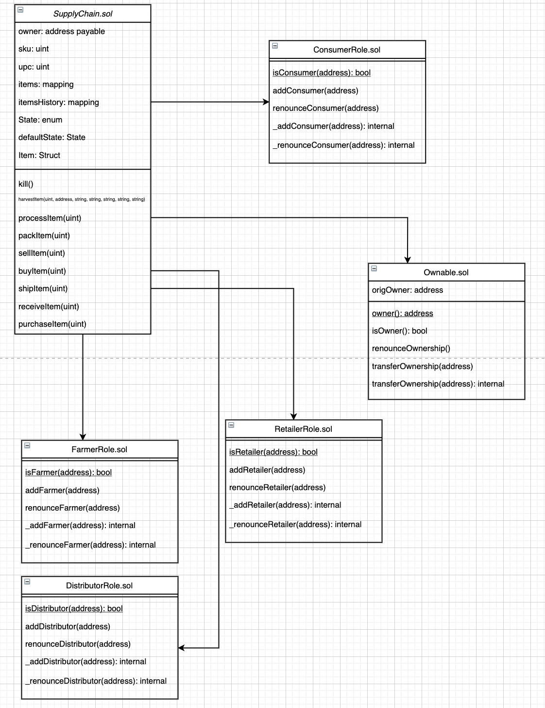

# Supply chain & data auditing

## Activity diagram :

## Sequence diagram :

## State diagram :

## Class diagram :

Transaction hash:    `0xbe8fe1eda0287c3481a7a3d4084b17a2f5d8b73d343bf885700dcc6b69cb5b19`

contract address:    `0x9374f7994FE6696A99a7291E69bC000aBF1202d9`

## Libraries

* Truffle v5.0.2

* Node v12.20.0

* truffle-assertions(^0.9.2)

        Used to assert the events returned from a contract.

* truffle-hdwallet-provider(^1.0.17)

        Used to deploy the smart contract to rinkeby network.
* web3(^1.3.6)

## How to run ?

### Smart contract

1. Compile the smart contract: `truffle compile`

2. Deploying:

    Local: `truffle migrate`

    Rinkeby: `truffle migrate --network rinkeby`

### Ganache

1. Run : `./1_start_ganache-cli.sh`

### UI

1. Run: `./2_start_node.sh`
2. Browse to: `localhost:3000`

